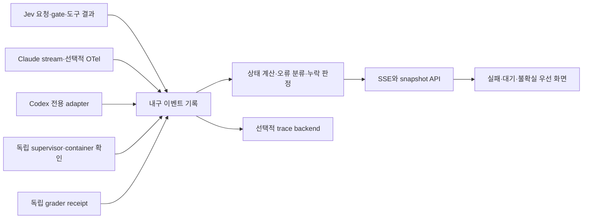

# 실시간 업데이트와 진행 실패 관측 조사

확인일: 2026-10-09 (Asia/Seoul). D-018에 따른 조사·읽기 전용 감사다.
현재 실행기의 오류를 합성으로 재현했으며, SSE/OTel/watchdog를 제품에 연결한 결과는 아니다.

## 결론과 현재 확인

우선순위는 **실패 원인과 종료 근거를 기록 → 생존·진행·결과를 구분 → 화면에 전달 → trace 분석 도구 연결**이다.
빠른 전달만으로 누락된 실패가 복원되지는 않는다. 현재는 비용·사용량 조회 화면을 완성한 상태이며,
실제 실행 중의 실패를 포괄적으로 감시하는 완료 조건은 충족하지 못했다.

2026-10-09 14:40:29 KST에 `GET http://127.0.0.1:8787/api/snapshot`을 읽었다.
HTTP200, warnings0, 기록7건 모두 control/completed였다. 별도 evaluation은 failed2/passed2/not_run3이었다.
failed2는 기존 빈 제출 대조군이다. **새 Jev/Claude 실행이 실패했다는 증거가 아니다.** live 기록은 없었다.
현재 Codex 대화와 개발 서브에이전트 진행도 이 benchmark 기록 루트에 자동 연결되지 않는다.

소스 확인 명령은 `sg run --lang javascript --pattern 'setInterval($$$ARGS)' dashboard/app.js`와
`sg run --lang javascript --pattern 'processResult($$$ARGS)' bin/benchmark-run.mjs`, 관련 파일의 `rg`/`sed`다.
`sg`는 deprecated 경고를 냈지만 패턴 검색은 성공했으므로 다른 도구로 바꾸지 않았다.
코드 근거상 화면은3초 polling이며 매 요청 때 로그 전체를 동기 재독해한다. snapshot 생성 시각은
원천 작업의 마지막 진전 시각과 다르다. 프로세스 생존을 직접 확인하는 watcher는 없다.

세부 조사는 [전송·화면](research/REALTIME_TRANSPORT.md), [도구 비교](research/OBSERVABILITY_TOOLS.md),
[현재 실패 감사와 재현](research/CURRENT_FAILURE_AUDIT.md)로 나누었다. 공식 문서상 기능,
현 소스 관측, 합성 재현, 향후 제안을 구분한다. 역할은 각 `docs/agents/REALTIME_*.md`에 먼저 기록했다.

## 이번 합성 감사에서 실제 확인한 실패 공백

`node /private/tmp/jev-realtime-audit.CRhMrJ/audit.mjs`로20개 장애·경계 조건의 현재 동작을 확인했다.
결과는 `/private/tmp/jev-realtime-audit.CRhMrJ/results.json`이다. 정상 처리가 확인된 사례와
현재 결함을 재현한 사례를 함께 포함하므로 **20개 성공 요구사항 통과**로 보고하지 않는다.

| 재현 | 현재 화면/집계의 관측 | 필요한 보완 |
|---|---|---|
| 도구 exit7 | gate가 복구를 허용하지만 activity는 `observed` | 도구 실패와 run 전체 실패를 분리해 표시 |
| 호출 한도 초과 | gate는 stopped, 새 event0, run은 running | 한도 종료 원인 기록과 gate 상태 전파 |
| Claude final 뒤 runner final 누락 | deadline 뒤에도 completed | provider 종료와 cleanup/runner 종료를 분리 |
| CLI exit0·유효 final 없음 | run completed, Claude uncertain1, wrapper는 실패 조건 | wrapper outcome을 별도로 보존 |
| 종료되지 않은 기록 | deadline 이전 running, 이후 uncertain | 독립 생존 확인과 단계별 대기/정체 판정 |
| 실제 제출물 형식의 grader result | evaluator model_calls0에서 control 추론 | 생성 run·artifact·평가 receipt 연결 |

기록 실패, provider 오류/불확실, malformed decision 거절, 평가 진행 중 목록 부재도 확인했다.
부분 UTF-8 보존·중복 억제·명시적 cleanup 실패 표시는 기존 구현대로 동작했다.
실제 컨테이너/사용자 작업에 장애를 주입하지 않았으며, 제품 코드는 이번에 수정하지 않았다.
재현별 현재 동작과 제안하는 수용 기준은 [감사 matrix](research/CURRENT_FAILURE_AUDIT.md)에 있다.

## 서로 구별할 관측 대상

| 관측 대상 | 필요한 증거 | 실패 또는 미확인 표시 | 이 신호만으로 판단할 수 없는 것 |
|---|---|---|---|
| 화면 연결 | 마지막 HTTP/SSE 수신·재연결 상태 | 연결 끊김, 오래된 화면 | 실행기 정상 여부 |
| 수집·저장 | 마지막 원천 event cursor, 읽기/쓰기 오류, queue 상태 | 관측 중단, 로그 불완전 | 모델이 멈췄는지 여부 |
| 실행기·컨테이너 | 실행 식별자, child exit/signal, supervisor lease, container inspect | 사망 확인, 생존 미확인 | 작업이 유용하게 전진하는지 |
| 에이전트·동작 진행 | 현재 단계, 시작 시각, 마지막 도구/응답, 대기 사유 | 입력 대기, 장기 무진전 의심 | 조용한 장기 추론의 실패 확정 |
| 요청·도구 결과 | response/timeout/error, MCP isError, exit code | 실패, 중단, 결과 불확실 | 전체 구현 실패 여부 |
| 구현 결과 | 명세와 연결된 독립 grader receipt | 통과/불통과/미평가 | 모델 API 정상 여부 |
| 사용량 완전성 | 요청 수와 receipts 분모, 출처·단위 | 관측 부분합, 비용 미확인 | 실제 구독 청구액 |

`running` 한 값으로 합치지 않는다. 예를 들어 `실행 중 · 도구 실패1건 · 복구 시도 중`이 가능하고,
`실행 종료 · 평가 불통과`도 정상적인 표현이다. 사용자 취소는 provider 오류와 분리한다.
무진전은 우선 의심 상태다. heartbeat를 보내는 무한 루프도 있고, CPU가 낮은 API 대기도 있다.
Jev의 낮은 confidence나 에이전트의 자체 완료 선언은 객관적 실패/성공 증거가 아니다.

## 전달 기술 비교와 선택 제안

| 방식 | 장점 | 필요한 보완 | 현재 적용 판단 |
|---|---|---|---|
| 주기 polling | 지금 구조와 호환, 새 snapshot으로 복구 간단 | 반복 재독해, 변경 없는 전송, background timer 지연 | fallback과 정합성 재검사로 유지 |
| Long polling | 변경 없을 때 응답 대기, 요청 단위 cursor 가능 | 재요청 race와 서버 대기 연결 관리 | 가능하지만 SSE보다 이 프로젝트에서 얻는 추가 이점 작음 |
| SSE | 서버→화면 push, browser 자동 재접속, event ID | 서버의 replay 저장소, gap 처리, 느린 client 처리, proxy buffering | 읽기 전용 화면의 우선 제안 |
| WebSocket | 지속적인 양방향 상호작용 | 재접속·재전송·flow control 직접 설계 필요 | 원격 interactive terminal 등 실제 양방향 필요 시 재검토 |

SSE는 전달 통로다. durable replay와 이벤트 중복 제거는 별도 구현해야 한다.
연결 heartbeat는 stream 연결의 생존만 알려 준다. browser 탭이 멈추어도 서버의 실패 탐지는 계속돼야 한다.
[WHATWG SSE](https://html.spec.whatwg.org/multipage/server-sent-events.html),
[MDN WebSocket](https://developer.mozilla.org/en-US/docs/Web/API/WebSockets_API), 자세한 출처는 전송 조사 문서를 따른다.

권장 흐름은 다음과 같다. **설계 제안이며 미구현**이다.

초기에는 로컬 JSONL을 내구 원장으로 두고 reader를 변경분 중심으로 바꿀 수 있다.
`fs.watch`는 변경 힌트로 쓰되 유일한 근거로 삼지 않고, 주기적인 파일/offset 정합성 검사를 병행한다.
Node는 플랫폼·파일 시스템에 따라 watch가 일관되지 않을 수 있음을 명시한다.
[Node fs.watch caveats](https://nodejs.org/api/fs.html#caveats)
다중 writer·조회량이 늘면 로컬 SQLite 단일 writer/read model을 검토한다. 지금부터 Kafka나 별도 DB군을
필수로 두는 근거는 확보하지 않았다. 중요한 시작·종료·실패는 내구 저장하고, UI 표시용 text delta는
합쳐 전송해 관측 자체가 토큰·실행 시간·저장량을 과도하게 늘리지 않도록 한다.

## 각 실행자로부터 확보할 수 있는 신호

**Jev와 benchmark gate.** 우리가 소유한 wrapper가 request/action start/end, stop reason을 직접 기록하는
경로가 우선이다. 요청 실패·결과 불확실·호출 한도·판단 보류·도구 실패를 다른 code로 둔다.
응답이 없다는 이유로 provider가 처리하지 않았다고 단정하거나 자동 재호출하지 않는다.
HTTP 성공과 decision 채택, tool 성공, 제품 테스트 통과를 연결된 별도 사건으로 남긴다.

**Claude.** 현재 stream 계측 외에 선택적 native OpenTelemetry의 `api_request`, `api_error`,
`api_retries_exhausted`, request 식별자·attempt가 문서화돼 있다. 따라서 이전 안내의 HTTP 횟수 미확인은
**현재 채택한 stream 집계 범위**에 해당하며, CLI 전체에 추가 계측 방법이 없다는 뜻은 아니다.
span tracing은 beta이며 opt-in이다. 문서 기본 batch 간격은 logs5초/metrics60초여서 설정만 붙이면
즉시 탐지된다고 할 수 없다. 현재 runner의 env allowlist는 telemetry 변수를 전달하지 않는다.
연결 시 원문 수집을 끄고 로컬 collector로 보내 실제 installed CLI의 schema·correlation·누락을 검증해야 한다.
[Claude monitoring](https://code.claude.com/docs/en/monitoring-usage)

`PostToolUseFailure`/`StopFailure` hooks는 도구/API 실패를 로컬 adapter에 남기는 대안이다.
프로세스 강제 종료 때 hook 실행은 기대하지 않는다. 기존 runner의 격리/설정 제한을 유지하면서
run별로 필요한 hook만 전달하는 호환성 검사가 선행돼야 하며 전역 사용자 설정을 변경하는 방식은 피한다.
[Claude hooks](https://code.claude.com/docs/en/hooks)
세부 token delta가 필요하면 `--include-partial-messages`가 별도 선택지다. 원문 streaming과
사용량 확정은 다르므로 delta 개수로 billed tokens를 산출하지 않는다.
[Claude programmatic streaming](https://code.claude.com/docs/en/headless)

**Codex.** 로컬 `codex exec --help`에서 `--json` JSONL 지원을 확인했다. `codex --version`은
0.144.1이며, PATH alias 생성 permission 경고가 있었지만 help/version은 exit0이었다. 프롬프트를
실행하지 않았다. 공식 noninteractive 문서는 turn/item/error event를, App Server 문서는
상태·토큰·도구 lifecycle을 제공한다. `turn/completed`도 payload status가 failed/interrupted일 수 있다.
[noninteractive](https://developers.openai.com/codex/noninteractive/), [App Server](https://developers.openai.com/codex/app-server/)
이 문서는 확인 시 공식 ChatGPT Learn 문서로 redirect됐다. 로컬 CLI와 현재 Desktop bundled runtime은
같다고 가정하지 않는다. 새 CLI stream 연결과 **이미 진행 중인 이 Desktop 대화의 구독**은 다른 문제다.
후자는 현재 호스트가 허용하는 상태 API/연결 방법 검증이 남아 있다. 사용자 전체 세션 저장소를
무차별 스캔하거나, 관측을 위해 기존 대화를 resume/복제하는 방식을 제안하지 않는다.

**MCP/Docker.** JSON-RPC transport 성공 안에도 `isError:true`인 도구 실패가 있을 수 있으므로
둘을 따로 분류한다. Docker는 die/oom/health_status 등 이벤트가 있지만 과거 반환 개수에 제한이
있으므로 reconnect 때 현재 container state를 대조해야 한다. 프로세스 ID는 재사용되므로 PID만으로
새 실행을 이전 실행의 생존으로 해석하지 않는다. container ID, run attempt, 시작 식별자를 함께 쓴다.
[MCP errors](https://modelcontextprotocol.io/specification/2025-06-18/server/tools#error-handling),
[Docker events](https://docs.docker.com/reference/cli/docker/system/events/)

## 기존 도구를 붙이는 선택지

| 선택지 | 지금 얻는 것 | 추가로 책임질 것 | 이 프로젝트의 제안 |
|---|---|---|---|
| 현재 화면+로컬 원장 | Jev 단위·gate·실행 평가를 원하는 의미로 표시 | 생존·진행 계측, 정확한 종료 계약 | 먼저 보강 |
| Phoenix | local trace tree, 수동 agent/tool/evaluator 계측 | Jev span·billing 매핑, 종료 안 된 작업의 생존 판정 | trace viewer가 필요할 때 첫 비교 후보 |
| Langfuse | 공용 LLM trace·평가·프롬프트 관리 | 다중 저장 서비스, scope 필터, async 수집·flush | 팀 플랫폼 요구가 생기면 재검토 |
| LangSmith | LangChain 전환 없이 wrapper/OTLP trace | 배포·license 조건, 자체 watchdog | 기존 사용 기반이 있으면 비교 |
| OTel+Grafana | 호스트·수집기·실행 장애를 함께 관측 | backend별 신호 저장·알림, No Data와 성공 분리 | 다중 호스트 운영 시 확대 |
| Temporal/Prefect | 장기 실행·기한·상태·복구 관리 | 실행 엔진 이관, 재시도와 부수 효과 정책 | 관측만을 위해 바로 이관하지 않음 |

운영 부담에 따른 설계 판단이며 설치 시간·속도 우위 실측은 아니다. 각 공식 근거와 배포 조건,
failed span만으로 정체/무기록 종료를 잡지 못하는 한계는 [도구 조사](research/OBSERVABILITY_TOOLS.md)에 있다.
Jev decision provider의 자동 지원이나 Claude 구독 청구액 조회를 어느 도구도 이 조사에서 입증하지 않았다.

## 내구 기록과 상태 판정 계약 제안 (상세)

이벤트 공통 필드: `schema_version`, `run_id`, `attempt_id`, `source_instance_id`, `source_seq`,
`event_id`, `parent_event_id`, `occurred_at`, `observed_at`, `phase`, `type`, `status`, `error_code`,
`evidence_ref`, `retry_policy`, `side_effect_outcome`. 중앙 수집 순서는 별도 durable cursor로 둔다.
벽시계는 표시용이고 동일 프로세스의 duration은 monotonic clock으로 계산한다.

- lifecycle: run 시작, provider 시작/응답, gate 선택/보류/정지, action 시작/종료, agent 종료,
  artifact 정지 확인, runner 종료, grader 시작/종료, telemetry gap/복구를 구별한다.
- source_seq는 source 재시작 때 epoch를 바꾸고 gap·중복을 검출한다. 같은 event ID의 내용 충돌은
  정상 중복으로 버리지 않는다. 화면에 미완전성을 노출한다.
- 정상 종료에는 runner의 종료 근거가 필요하다. Claude result만 먼저 도착하면 `finalizing`으로 두고
  cleanup 실패나 runner 사망을 후행 실패로 보존한다. 감사의 관련 재현을 수용 기준으로 삼는다.
- `evaluator_model_calls:0`는 평가기의 계측이다. workload evidence kind를 그 값으로 정하지 않는다.
  grader는 `evaluates_run_id`와 artifact digest를 통해 생성 실행과 연결한다.
- 이벤트 저장 실패면 무기록으로 새 유료 동작을 계속하지 않는다. 종료·정리 결과는 가능한 별도
  supervisor receipt에 남기며 관측 저장소도 쓸 수 없으면 사용자에게 관측 중단으로 보여 준다.
- JSONL/OTel/SSE 재전송은 **관측 데이터 전송**이다. 모델 POST·도구 실행의 재시도와 별도 정책이다.
  비확정 부수 효과가 있는 작업에는 replay를 하지 않는다.

OpenTelemetry 표준은 operation/span/error를 연결하는 공통 언어로 참고하되, GenAI 규약은 개발 중이라
버전을 고정하고 adapter 안에서 변환한다. 런타임 생존과 작업 목표 충족을 span ERROR 하나로 대체하지 않는다.
[OTel error semantics](https://opentelemetry.io/docs/specs/semconv/general/recording-errors/),
[GenAI conventions](https://opentelemetry.io/docs/specs/semconv/gen-ai/)
collector queue/WAL도 디스크 오류·용량 초과·긴 장애에서 손실될 수 있다. collector 자체의 수신 시각,
queue 포화·drop·export 오류도 관측해야 한다.
[OTel resiliency](https://opentelemetry.io/docs/collector/resiliency/)

초기 SSE는 전체 상태 교체 방식을 권고한다. `server_epoch:revision`으로 중복·역순을 식별하고
과거 revision을 보관하지 않은 서버는 reset과 최신 snapshot을 보낸다. 이는 모든 중간 사건의
replay 보장이 아니다. 중요한 incident는 내구 원장과 snapshot에 유지해서 단절 중 실패가 사라지지 않게 한다.
전체 사건 감사 화면이 필요해지면 별도 durable cursor/page API와 retention gap 계약을 추가한다.
느린 client에는 미전송 최신 snapshot 하나만 두어 buffer를 제한한다. 공개 raw log route는 만들지 않는다.

## 사용자가 먼저 봐야 할 화면

첫 화면에 실행 수치보다 **실패·중단·사용자 입력 대기·불확실 사건 목록**을 우선 배치하는 안이다.
각 사건은 대상 run/agent/단계, 시작과 마지막 증거 시각, 원인 code, 영향 범위, 다음 조치,
이후 복구 여부를 보여 준다. 지금 발생한 에러와 과거 복구된 에러를 함께 빨간 실패로 합치지 않는다.
API 오류 메시지 원문 대신 정제한 원인과 비공개 evidence 참조를 사용한다.

상단 시각도 `화면 수신`, `원천 마지막 이벤트`, `마지막 진행`, `생존 확인`으로 구분한다.
대기 사유는 model/tool/permission/user/rate_limit/unknown으로 보여 주되 근거 없는 사유는 unknown이다.
실제 프로세스가 죽었으면 `종료 확인`, heartbeat만 끊겼으면 `생존 미확인`, 로그는 들어오지만
동일 실패를 반복하면 `반복 실패/무진전 의심`으로 표시한다. 조용함을 곧바로 실패로 확정하지 않는다.
Mac sleep/네트워크 단절/collector 재시작도 분리하고 복귀 시 현재 상태를 재대조한다.

## 검증 지표와 구현 순서 제안

측정할 시각은 `failure_injected`, `failure_observed`, `event_durable`, `ui_rendered`다.
탐지 지연과 표시 지연을 분리하며, timeouts는 fault onset과 timeout expiry를 함께 기록한다.
서로 다른 호스트의 시계 동기화가 검증되지 않았으면 해당 구간 지연을 미확인으로 둔다.

- 탐지 coverage: 탐지한 실패 수 / 주입한 해당 범주의 실패 수. 분모와 미탐을 남긴다.
- 오탐: 정상·정당한 대기 구간에서 발생한 잘못된 실패 알림 수 / 정상 대기 구간 수.
- 지연: 범주별 fault→관측, durable→표시 p50/p95 및 timeout 사례 구분.
- 데이터 정합성: 원천 event 수 대비 누락/중복 수, replay 후 state 동일성, 비용 중복 합산 여부.
- 관측 부담: monitor CPU/RSS, disk write/second, queue 길이, UI update량, 기존 실행 wall time 차이.
- 복구: 원인/대상 확인에 걸린 시간, 불확실 요청 중복 수행0 여부, 오래된 빨간 알림 해소 근거.

초기 성능 목표 수치는 아직 확정하지 않는다. 로컬 fault injection으로 polling/SSE 양쪽을 같은
사건·부하·탭 상태에서 비교한 뒤 목표를 정한다. 제품 성능과 합성 사건 탐지 성능을 혼합하지 않는다.

1. **P0 기록·상태 정확성:** 감사에서 재현한 누락/거짓 종료 수정, stop reason, tool result,
   run finalization, evaluator 연결을 먼저 완료한다.
2. **P1 생존·진행 관측:** 독립 supervisor, heartbeat·deadline·대기 상태, source freshness와 incident projection.
3. **P2 전달·화면:** 전체 snapshot SSE+revision/reset+polling fallback, incident 우선 화면,
   같은 합성 사건으로 end-to-end 비교. 모든 중간 사건 replay는 별도 확장이다.
4. **P3 trace 확대:** Claude native telemetry 및 Codex adapter를 실제 버전에서 검증하고 필요하면
   Phoenix 등의 local trace viewer를 연결한다. 도구 도입 자체를 실패 탐지 완료로 보지 않는다.

범위 우선순위는 질문 대기지만 두 범위(benchmark 실행과 현재 개발 에이전트)의 연결 가능성을 조사했다.
이번에는 제품 코드·실행 중 서버·인증·컨테이너·전역 설정을 수정하지 않았다. 설치·모델 추론·push 없음.
기존167개 테스트 통과는 과거 구현 회귀 근거다. 이번에 발견한 진행 실패 관측의 충분성을 보장하지 않는다.
